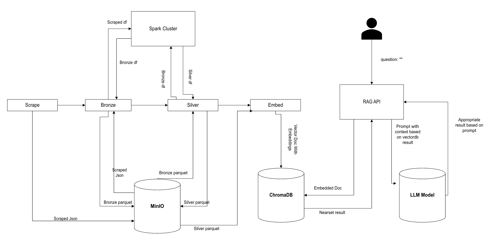

# Bookstore RAG API
This project implements a complete, containerized Retrieval-Augmented Generation (RAG) pipeline. It allows users to ask natural language questions about a collection of books and receive answers generated by a local Large Language Model (LLM), based on semantically relevant information retrieved from a vector database.

The entire stack is managed by Docker Compose and includes services for data orchestration (Airflow), data processing (Spark), vector storage (ChromaDB), model serving (Ollama), and a query API (Flask).

## Features
* End-to-End RAG Pipeline: From data ingestion to question-answering.

* Local First: Utilizes local models for both embedding (all-MiniLM-L6-v2) and generation (mistral) via Ollama, ensuring privacy and control.

* Semantic Chunking: Book descriptions are intelligently chunked based on semantic meaning to improve retrieval accuracy.

* Vector Search: Uses ChromaDB to store and query document embeddings for fast and relevant context retrieval.

* REST API: A simple and fast API built with Flask and Gunicorn provides an endpoint (/ask) for querying the system.

* Fully Containerized: All services are defined in docker-compose.yaml for easy setup and consistent deployment.

* Simplified Management: Includes a Makefile with simple commands (make up, make down, etc.) to manage the application stack.

## DAG STEPS

* Scrape: This Steps focus on Scraping books data from `https://books.toscrape.com` and store it as JSON in MINIO `run_id/raw/search_date/*.json` path
* Bronze: Bronze focus on basic formatting and cleaning and renaming of the data and stored in parquet formart in `run_id/bronze/search_date/*.parquet`
* Silver: Silver focus on data cleaning and other field derivation which could be further helpful in the analytics down the road. These files are then stored in `rund_id/silver/search_date/*.json`
* Embed: It focus on Semantic chunking of the data and storing those in the vector db with its metadata

## RAG API
It is served in Flask API. The API is a GET API and it takes question as param. 
sample: `http://localhost:5001/ask?question=<some_question>`

## Architecture
The application consists of several services that work together:

* Airflow: Orchestrates the data pipeline. The books_scraping_pipeline DAG is responsible for the ETL process.

* Spark: Used within the Airflow DAG to process the raw book data into a structured format (Parquet).

* Ollama: Serves the local LLM (e.g., gemma:2b). It's responsible for the "Generation" part of RAG. The model is pre-loaded into the Docker image for instant availability.

* ChromaDB: The vector database that stores the embeddings of the book data chunks and their metadata.

* Flask RAG API: A lightweight web server that exposes the /ask endpoint. It receives a user's question, queries ChromaDB for context, sends that context to Ollama, and returns the final answer.

## Prerequisites
* Docker
* Docker Compose

## Setup and Installation

### Setup
1. Clone the Repository

    `git clone <your-repo-url>`

    `cd <your-repo-directory>`


2. Copy `.env.example` to `.env` and fill in your values
3. Install dependencies: `pip install -r requirements.txt`
4. (Recommended) Use Docker Compose to start the full stack:
   ```sh
   make up
   ```
5. Access Airflow at http://localhost:8080 (user: airflow, password: airflow)
6. Access MinIO at http://localhost:9001 (user: minioadmin, password: minioadmin123)
7. Query the RAG API at http://localhost:5001/ask?question=<some_question>

## Architecture Diagram




# Future Works

* Implement IP address rotation to prvent from being flagged by the websites 
* Expand data 
* Implement star and snowflake schemas for data warehousing 
* Iteratively improve the chunking mechanism of the data for better relevancy and result
* Work on prompt engineering for better data retrival
* Implement GPU acclerated evaluation and execution when working with LLMs
* Build UI to interact with the RAG

## DEMO LINK: 
`https://drive.google.com/file/d/1dHTzhN_MP_SPi0MxmCx7PNtEx22HTVXt/view?usp=drive_link`


